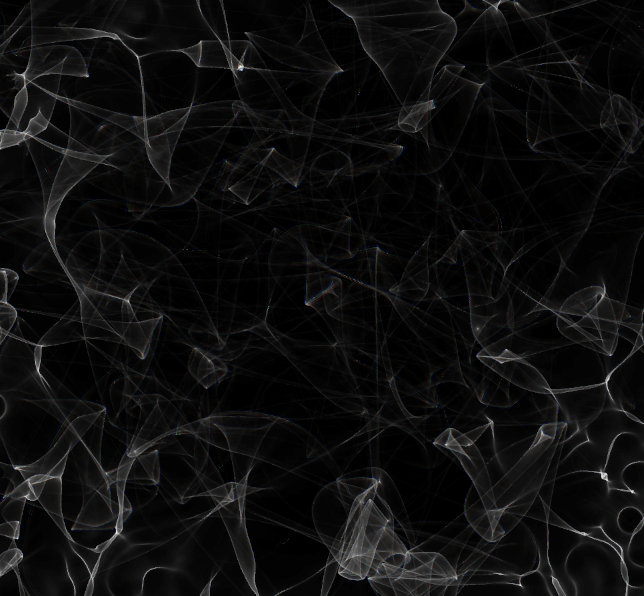

# light-sculpting
Loosely based on patent [US10732405B2](https://patents.google.com/patent/US10732405B2/en).

My take on the problem:
1. We have an incoming irradiance map, $f(x, y)$, and a target irradiance map $g(x, y)$. The goal is to find a transport plan $T:\mathbb{R}^2\rightarrow\mathbb{R}^2$ that squishes $f$ into $g$. Moving the image plane away from the lens should (approximately) trace out a geodesic between $f$ and $g$ in Wasserstein 2-space.
2. We can represent this transport plan as an optical surface if $T$ is curl free; i.e. if we make it so that $T=\nabla H, H:\mathbb{R}^2\rightarrow\mathbb{R}$.
3. I could use a differentiable rasterizer, but I'm getting annoyed with setting up things in Python, so why not represent $H$ as a sum of bumps/Gaussians?

I'll write this all in WebGL and use geometry buffers with wavefront-mesh-deformation-caustics to make rendering quick. That's the plan!

