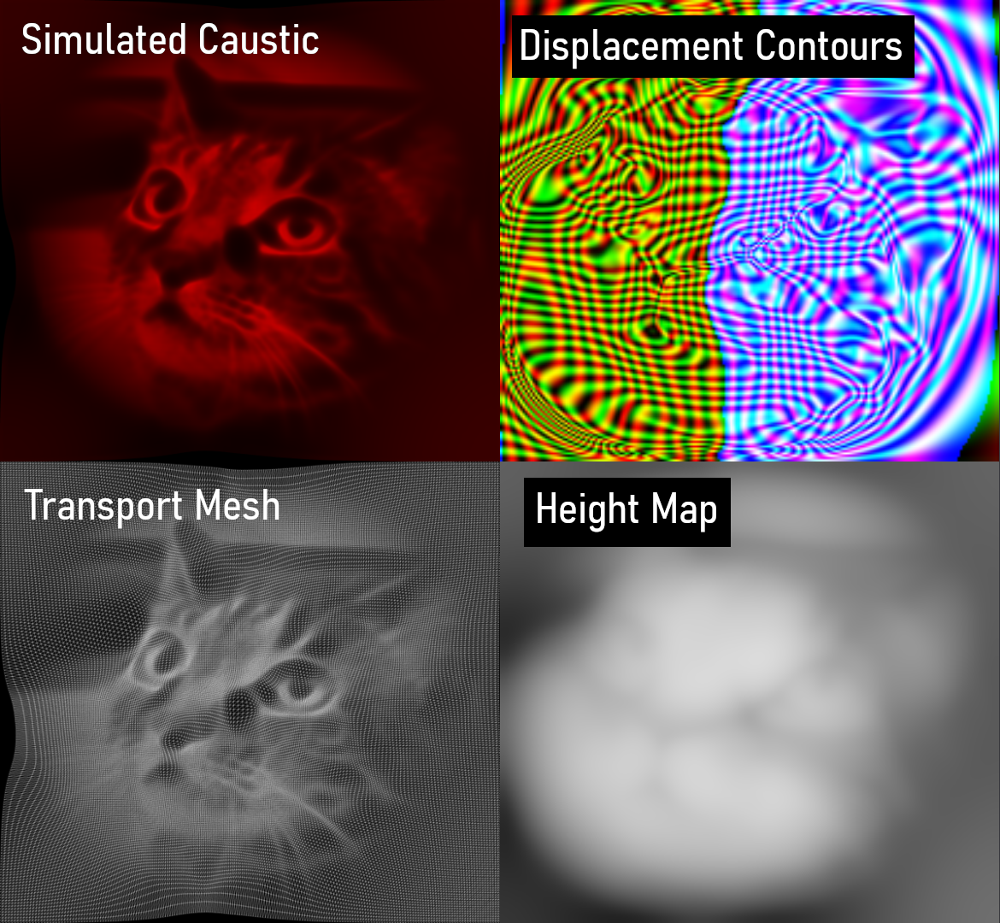

# light-sculpting

This is a [caustic pattern design](https://en.wikipedia.org/wiki/Caustic_(optics)#Optimal-transport-based_caustic_pattern_design) GPGPU algorithm written in WebGL/JavaScript (via Three.js). It uses [multigrid](https://en.wikipedia.org/wiki/Multigrid_method) finite-difference relaxation methods (no global solvers, only local kernel ops!) to compute the optical surface heightmap.

A quick breakdown of the problem:
1. This is an optimal transport problem; we're trying to focus an incoming irradiance map $f(x, y)$ to a target irradiance map $g(x, y)$. To first order, our optical surface with heightmap $h(x, y)$ pushes a planar wavefront around by $(n_1/n_2)\nabla h$.
2. The goal is to find the curl-free transport plan $T:\mathbb{R}^2\rightarrow\mathbb{R}^2$ that squishes $f$ into $g$. Moving the image plane away (increasing $x$) from the lens should (approximately) trace out a geodesic between $f$ and $g$ in Wasserstein 2-space.
3. To first approximation (Snell's Law), the transport plan is the gradient of the surface height map ($T(v) = v + l\nabla h$).

My first thought was to use a differentiable rasterizer and just descend into a solution, but I got annoyed with setting up things in Python, so I eyeballed an optimal transport algorithm. Turns out I accidentally sort-of-replicated [this paper](https://dl.acm.org/doi/10.1145/2580946), which is a kind of funny read, because the authors don't realize they're exploring a transport problem.

Not really ready for use yet, but it works!
